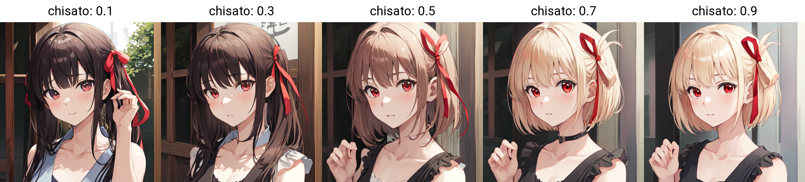
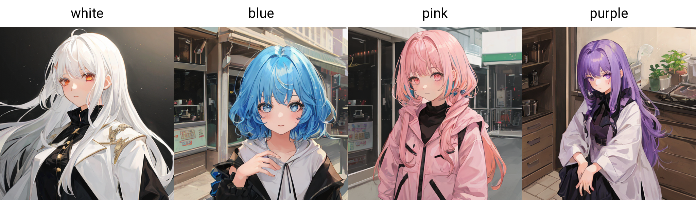
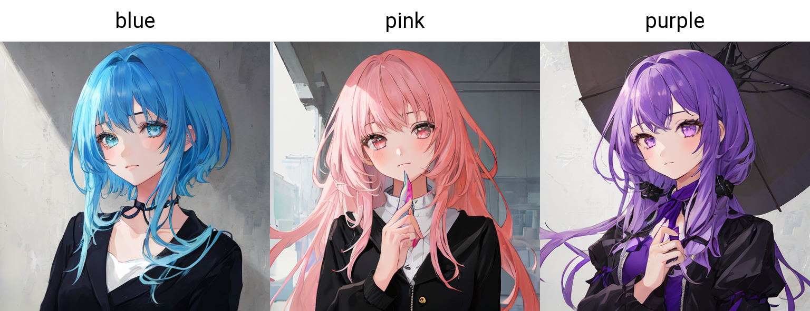
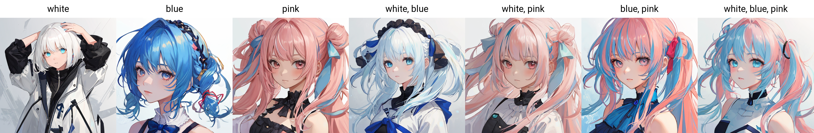
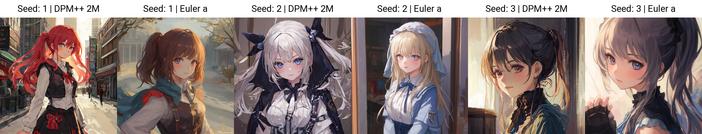

# Stable Diffusion web UI - XYZ Addon

This is a [Stable Diffusion web UI](https://github.com/AUTOMATIC1111/stable-diffusion-webui) extension that adds extra utility axes to the built-in [X/Y/Z plot](https://github.com/AUTOMATIC1111/stable-diffusion-webui/wiki/Features#xyz-plot) script

### Additional axes

- [Addon] Extra Network Weight
- [Addon] Prompt S/R
- [Addon] Prompt S/R (P)
- [Addon] Prompt S/R Combinations 
- [Addon] Prompt S/R Combinations (P)
- [Addon] Prompt S/R Permutations
- [Addon] Prompt S/R Permutations (P)
- [Addon] Multi axis
- [Addon] Override settings

# Documentation and usage examples

## Extra Network Weight - (Lora or Hypernetworks)
`[Addon] Extra Network Weight` is an axis meant to help test Extra Network Weight
to use this axis specify an Extra Network in your prompt by `Name` followed by a colon`:` and then a list of `float` or `range`separated by commas `,`

### Example

Base Prompt:
```
1girl <lora:chisato:1>
```
`[Addon] Extra Network Weight` Axis value:
```
chisato: 0.1, 0.3, 0.5, 0.7, 0.9
```



This will generate an axis of 3 with the Extra Network Weight set to `<lora:my_lora:0.3>` `<lora:my_lora:0.6>` `<lora:my_lora:0.9>`

---

## Prompt S/R
This category of axes performs prompt `Search and Replace` similar to the built-in `Prompt S/R`
The `(P)` suffix indicates that the axis is a Placeholder axis where the first value is use as a "marker" to be replaced with subsequent values and will not be included in the prompt

- `[Addon] Prompt S/R`
this is Identical to the built-in `Prompt S/R` axis
- `[Addon] Prompt S/R (P)`
same as `[Addon] Prompt S/R` but the first value is a `Placeholder`

### Example
Base Prompt:
```
1girl white hair
```
`[Addon] Prompt S/R` value:
```
white, blue, pink
```
This will generate 3 images with prompts
`1girl blue hair` `1girl pink hair` `1girl white hair`


If instead we use `[Addon] Prompt S/R (P)` this will only generate 2 images with prompts
`1girl blue hair` `1girl pink hair`


`[Addon] Prompt S/R Combinations` and `[Addon] Prompt S/R Permutations`
Combinations and Permutations variants is base on the base mechanism of the `Prompt S/R`, but as apposed to replacing the marker with a single value, it will replace the `Placeholder` with the combinations or permutations of the subsequent values

### Example
Base Prompt:

```
1girl white hair
```
`[Addon] Prompt S/R Combinations` Value:
```
white, blue, pink
```


`[Addon] Prompt S/R Permutations`
works the same just with permissions


like before if placeholder mode is used the first prompt will not be included in the axis


you can specify the number of elements of the range of number elements used in the axis

by using `num:` or `num:num:` at the beginning of the value

Base Prompt:
```
1girl white hair
```
`[Addon] Prompt S/R Permutations`
```
2:white, blue, pink, purple
```


```
1:2:white, blue, pink, purple
```


## Multi axis
`[Addon] Multi axis` is a pseudo axis that allows you to combine multiple axes in one axis

Multiplexes are specified with syntax of 

`axis-1-name` `:` `axis-1-values` `|` `axis-2-name` `:` `axis-2-values` `|` `axis-2-name` `:` `axis-2-values`

Rules 1 `axis-name` and thre `values` are separated by colon `:`, this formes an `axis:values`
> `axis-1-name` `:` `axis-1-values`

Rule 2 `axis:values` are separated by `|`,
> `axis-1-name:axis-1-values` `|` `axis-2-name:axis-2-values`

singe quote


Example of 3 Seed and 2 Sampler in one axis
```
Seed: 1, 2, 3 | Sampler : DPM++ 2M, Euler a
```


Example of 3 Seed 2 Sampler and 2 Clip skip in one axis
```
Seed: 10, 20, 30 | Sampler : DPM++ 2M, Euler a | Clip skip: 1, 2
```


note: even though the syntax supports nesting `Multi axis` there's no practical use


# CSV - Comma-Separated Values

## Basic

CSV is a common method of specifying a list of values

As the name suggest different values are separate by commas `,`

| A | B | C |
|-|-|-|
```
A, B, C
```
## Intermediate

### Separator and Quote character
sometimes you may find yourself in a situation that you would need a comma (`,`) inside a value, but as comma is used as the separator you can't write commas normally, the solution double quotes `""`

| (A,a) | (B,b) | (C,c) |
|-|-|-|
```
"(A,a)", "(B,b)", "(C,c)"
```

but what if you need literal double quotes inside the values?
| "(A,a)" | ("B",b) | (C,"c") |
|-|-|-|

```
"""(A,a)""", "(""B"",b)", "(C,""c"")"
```
repeat the double qoute inside a quoted section to represent a literal double quote

## Advance

### None default Separator and Quote character
by default the comma `,` and double quotes `"` are used as `separators` and `quote calculator`
but this may not always be the case
if specified they could be replaced with any other Single Character to suit the use case

For example in `[Addon] Multi axis` use `|` as the separator and `single quote` `'` at the quote character

| `,` | `\|` |
|-|-|
| `a,b,c` | `a\|b\|c` |

```
a, b, c
```
```
a | b | c
```

### leading and trailing spaces

Depending on the dialect of the CSV sometimes leading spaces can have influence on the results
For the Axis use by this extention all leading and trailing spaces are discarded

meaning these are equivalent
```
A,B,C
```
```
A,  B  ,C   
```

### new line character

any new line will automatically be treated as a separator same as comma (`,`)
if you need a little new line inside a value then you need to quote the value with dobule qoutes (`"`)

| aaa<br>bbb | ccc<br>ddd | eee<br>fff |
|-|-|-|

```
"aaa
bbb","ccc
ddd","eee
fff"
```


